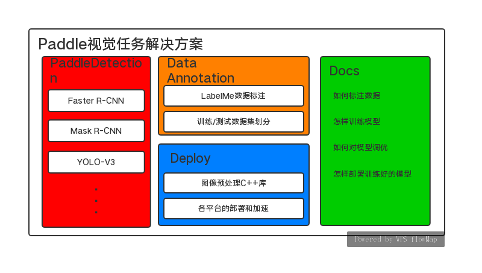

# PaddleSolution

 

PaddleSolution是基于PaddlePaddle的框架和模型生态，制定的一套面向企业用户的视觉任务解决方案。整个方案涵盖从数据准备，模型训练，调优到最终的预测部署。  
PaddleSolution解决方案整体架构如下图所示

其中PaddleSolution中的文档将会串通所有模块，整体文档目录如下：
1. 目标检测和实例分割任务  
2. 标注自己的数据  
3. 使用PaddleDetection训练模型  
4. 评估训练的模型  
5. 针对自己的数据，优化模型训练  
6. 部署训练的模型  
