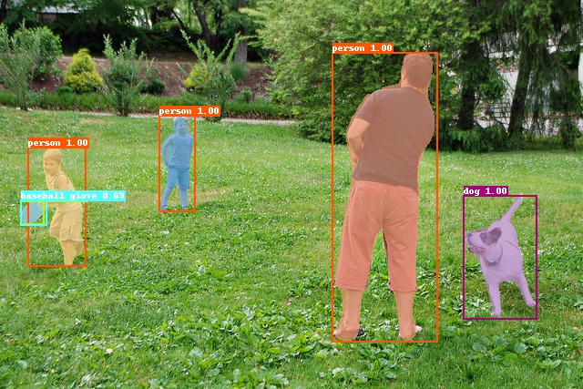

# PaddleSolution

 

PaddlePaddle提供了针对视觉任务的端到端企业解决方案，覆盖了从数据准备到模型训练的整个流程。在此Repo中，针对每种视觉任务，我们提供了现阶段准确率和效率皆优的神经网络模型，并展示了如何准备数据，如何使用PaddlePaddle完成模型的训练。

## 目录
* [1 简介](#1-简介)
* [2 数据准备](#2-数据准备)
* [3 模型训练](#3-模型训练)
  * [3.1 安装](#31-安装)
  * [3.2 训练](#32-训练)
  * [3.3 评估](#33-评估)
  * [3.4 预测](#34-预测)
  * [3.5 调优](#35-调优)
## 1 简介

PaddleSolution的目标是通过提供针对视觉任务的端到端解决方案，帮助用户打通从准备数据到训练模型的全部流程。

PaddleSolution提供了针对目标检测的神经网络模型[YOLO V3](https://pjreddie.com/media/files/papers/YOLOv3.pdf)，以及针对实例分割的模型[Mask R-CNN](https://arxiv.org/abs/1703.06870)，模型原理请参见[模型简介](./docs/1_简介/模型简介.md)。

    
    
Mask R-CNN预测结果示意图

 

## 2 数据准备

PaddleSolution目前支持[COCO](http://cocodataset.org)数据集格式。若不使用COCO数据集，用户需预先采集好用于训练、评估和预测的图片，并使用数据标注工具[LabelMe]((https://github.com/wkentaro/labelme))完成数据标注，最后用我们提供的[数据转换脚本](ppdet/data/tools/labelme2coco.py)将LabelMe产出的数据格式转换为模型训练时所需的数据格式。具体流程请参见[数据准备.md](./docs/2_数据准备/2_数据准备.md)。

## 3 模型训练

### 3.1 安装

运行PaddleSolution对环境有所要求，且需预先安装PaddlePaddle和其他依赖项。具体流程请参见[模型安装.md](./docs/3_模型训练/3.1_模型安装.md)。

### 3.2 训练

#### 3.2.1 目标检测

#### 3.2.2 实例分割

使用不同的主干网络，Mask R-CNN的分割准确率有所差别:

| 主干网络             | 检测准确率(Box AP) | 分割准确率(Mask AP) |                           下载                           |
| :------------------ | :-------------: | :--------------: | :----------------------------------------------------------: |
| ResNet50-vd-FPN     |       39.8      |       35.4       | [模型参数](https://paddlemodels.bj.bcebos.com/object_detection/mask_rcnn_r50_vd_fpn_2x.tar)|
| SENet154-vd-FPN     |       44.0      |       38.7       | [模型参数](https://paddlemodels.bj.bcebos.com/object_detection/mask_rcnn_se154_vd_fpn_s1x.tar) |

使用各主干网络进行训练、评估和测试所需的配置文件都在[configs](./configs)下，这些配置文件中部分配置的默认值是针对使用8块显卡训练COCO数据集所设置的，运行前请根据实际情况调整这些配置，具体的调整方法请参见[Mask R-CNN训练配置调整.md](./docs/3_模型训练/3.2.2.1_Mask_R-CNN训练参数调整.md)。

调整配置文件中的设值后，请参见[Mask R-CNN训练.md](./docs/3_模型训练/3.2.2.2_Mask_R-CNN训练.md)进行训练。

### 3.3 评估

#### 3.3.1 目标检测

#### 3.3.2 实例分割

PaddleSolution提供了已在COCO训练集上训练好的Mask R-CNN参数，用户可以下载模型参数并评估模型Mask R-CNN的表现，也可以用在自定义数据集上训练好的模型参数对模型进行评估。具体的评估流程请参见[Mask R-CNN评估.md](./docs/3_模型训练/3.3.2_Mask_R-CNN评估.md)。
### 3.4 预测

在训练好模型后，给定单张图片或者批量图片，就可以预测图片中各目标的位置、类别或像素点信息。具体的步骤以及可视化结果请参见[预测.md](./docs/3_模型训练/3.4_Mask_R-CNN预测.md)。

### 3.5 调优

[配置文件](./configs)中超参数的默认值对于COCO数据集来说是最优的，这些设定值对于其他数据集来说可能不是最优的。用户在训练自定义数据集时，可以调整这些超参数，以期获得准确率或效率的提升。Mask R-CNN超参数的调整策略请参见[Mask R-CNN模型调优.md](./docs/3_模型训练/3.5_Mask-RCNN调优.md)。
