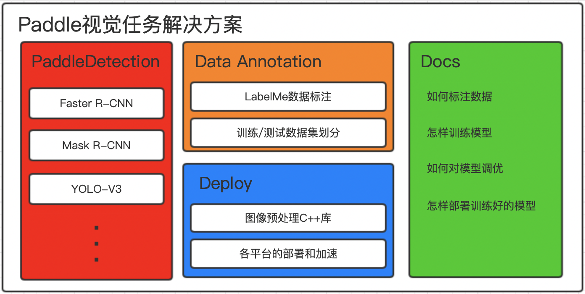

# PaddleSolution

 

PaddleSolution是基于PaddlePaddle的框架和模型生态，制定的一套面向企业用户的视觉任务解决方案。整个方案涵盖从数据准备，模型训练，调优到最终的预测部署。  
PaddleSolution解决方案整体架构如下图所示  
  

### PaddleDetection
PaddleDetection是由PaddlePaddle模型团队开发的检测库框架，包含Faster R-CNN、Mask R-CNN、YOLO-V3等主流和前沿检测模型。在本方案中，我们通过使用PaddleDetection解决视觉任务中的目标检测和实例分割两大问题。  

### DataAnnotation
DataAnnotation模块中，我们基于LabelMe工具标注数据，并提供相应脚本，帮助用户针对自己的数据，标注数据和快速构造训练/测试数据集。

### Deploy
Deploy模块用于指导用户如何将训练好的模型，通过C++部署到服务端，包括Windows和Linux平台。在模块中，提供了我们开发的图像预处理C++库，它涵盖了常用的图像预处理操作，帮助用户快速部署模型。

### Docs
Docs模块是整个解决方案的使用手册，我们将会在Docs中串通所有的模块，包括如下内容：  
1. [什么是目标检测和实例分割](.)
2. [标注自己的数据](.)
3. [使用PaddleDetection训练模型](.)
4. [评估训练的模型](.)
5. [针对自己的数据，优化模型训练](.)
6. [部署训练的模型](.)
