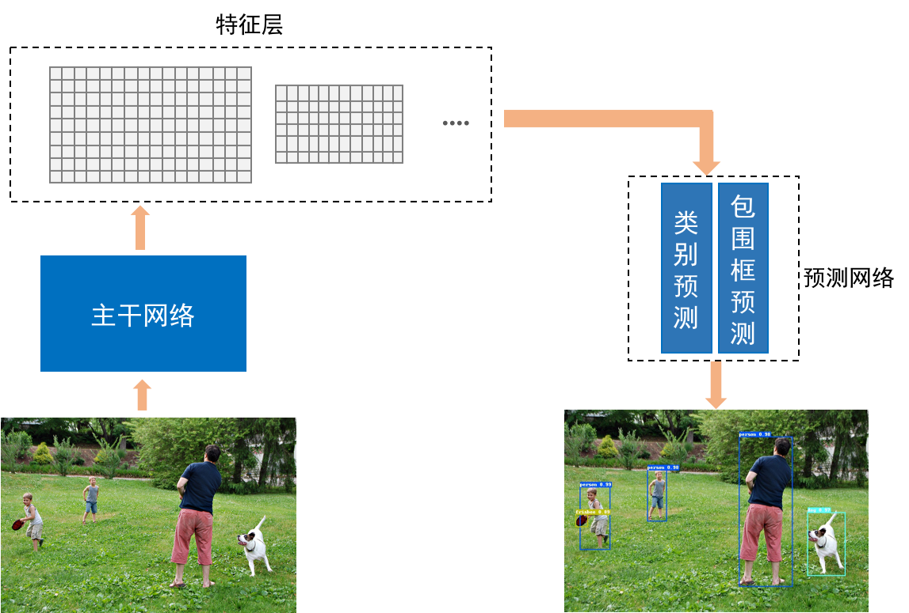

# 模型简介

## 目录
* [目标检测](#目标检测)
* [实例分割](#实例分割)

## 目标检测

目标检测的任务是给定一张图片，让计算机找出其中所有目标的位置，并给出每个目标的具体类别。通常用包围框来表示目标的位置，该框需紧凑地包围住目标的全部范围。

基于卷积神经网络的目标检测方法大致可分为两类：二阶段检测器和一阶段检测器。

二阶段检测器第一步是提取出目标可能存在的区域，这些区域称为候选框，第二步是对各候选框进行种类识别和位置回归操作，分别得到候选框属于各个类别的得分以及针对每一种类别微调后的位置。经典模型有Faster R-CNN和Cascade R-CNN等。

一阶段检测器去掉了预先提取候选框这一步骤，让网络直接输出各目标的位置和类别信息。经典模型有SSD和YOLO V3等。

二阶段检测器的精度都比较高，但是对每个候选框都要进行分类和回归的这一步骤导致此类方法非常耗时。而一阶段检测器具有的优点是检测速度快，但精度较二阶段检测器的低。

YOLO V3是现阶段检测准确率和效率都较高的模型，推荐用户使用YOLO V3来完成目标检测。如下图所示，YOLO V3的检测流程为：主干网络以图像作为输入，并输出多个特征层，这些特征层后续接入预测网络，用于预测各目标的包围框和类别。

    
    
YOLO V3的流程示意图

 

## 实例分割

实例分割的任务是在目标检测的基础上，找出各包围框内属于目标的像素点。Mask R-CNN是经典的实例分割模型，基本思想是首先利用候选框生成网络得到目标在图像中的候选框，其次用候选框池化操作提取出特征层上属于各候选框的特征，最后将候选框特征输入给分类子网络、回归子网络和分割子网络得到像素级别的检测结果。如下图所示，Mask R-CNN主要包含四个部分：

&emsp;&emsp;1. 主干网络。主干网络生成输入图像的特征层，用于后续的候选框生成，以及候选框的位置回归、种类识别和像素点分割。

&emsp;&emsp;2. 候选框生成网络。以主干网络输出的特征层作为输入，输出图像上可能存在物体的区域，这些区域称为候选框。

&emsp;&emsp;3. 候选框池化操作。以候选框和主干网络输出的特征层作为输入，输出特征层中属于各候选框的特征。

&emsp;&emsp;4. 分类子网络、回归子网络和分割子网络。以候选框的特征作为输入，输出候选框属于各个类别的概率、针对每一种类别微调后的位置以及属于各个类别的像素点分割结果。

 

    
    
Mask R-CNN的流程示意图

 

