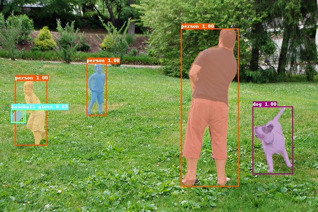

# 3.4 Mask_R-CNN预测

在训练好模型后，给定单张图片或者批量图片，就可以预测图片中各目标的位置、类别或像素点信息。

## 目录
  * [1. 单张图片的预测](#1单张图片的预测)
  * [2. 批量图片的预测](#2批量图片的预测)
  * [3. 模型保存](#3模型保存)

1. 单张图片的预测

通过添加`--infer_img`来指定待预测图片的路径：
```
export PYTHONPATH=`pwd`:$PYTHONPATH
export CUDA_VISIBLE_DEVICES=0
python tools/infer.py -c configs/mask_rcnn_r50_vd_fpn.yml --infer_img=demo/000000570688.jpg
```

可视化结果示意图下：

<div align="center">
    
    <p>Mask R-CNN输出结果示意图</p>
 </div>

2.批量图片的预测

通过添加`--infer_dir`来指定存放批量图片的文件夹路径：
```
export PYTHONPATH=`pwd`:$PYTHONPATH
export CUDA_VISIBLE_DEVICES=0
python tools/infer.py -c configs/mask_rcnn_r50_vd_fpn.yml --infer_dir=demo
```
可视化结果默认存放在`output`下，通过添加`--save_file`自定义存放路径。
```
export PYTHONPATH=`pwd`:$PYTHONPATH
export CUDA_VISIBLE_DEVICES=0
python tools/infer.py -c configs/mask_rcnn_r50_vd_fpn.yml --infer_img=demo/ --save_file=<path/to/save/file>
```

3. 模型保存

(#待补充)

&emsp;&emsp;通过添加`--save_inference_model`来保存预测模型，该模型在PaddlePaddle预测库中能够直接被导入而不需要再重新组网。
```
export PYTHONPATH=`pwd`:$PYTHONPATH
export CUDA_VISIBLE_DEVICES=0
python tools/infer.py -c configs/mask_rcnn_r50_vd_fpn.yml --infer_img=demo/000000570688.jpg \
                      --save_inference_model
```
